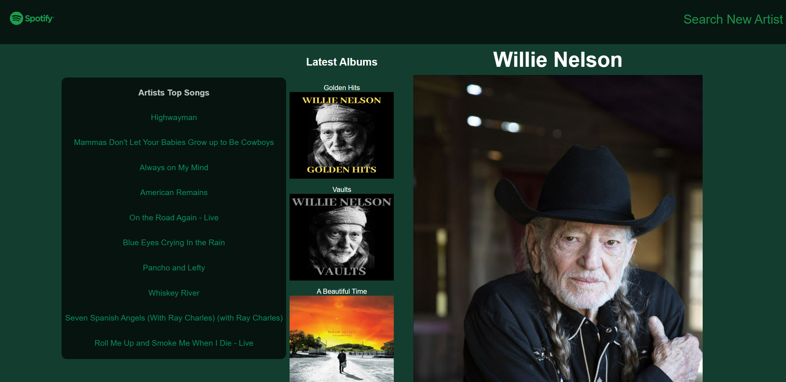
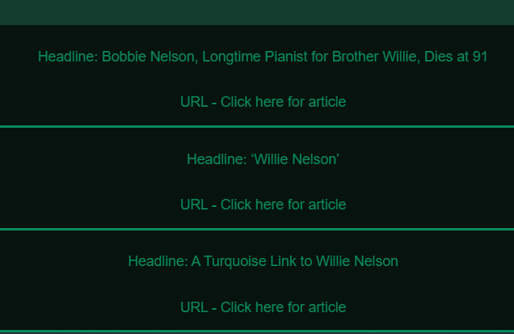

# Tunes and Tribunes

Welcome to our website!! Thank you for checking out tunes and tribunes, the website that lets you look up your favorite artist AND get their news sources.

# User Story

AS AN absolute music fanatic,
I WANT to be able to search my favorite artists and gather data about their latest music and news stories,
SO THAT I can be an informed listener

# Technologies used

HTML, CSS, Tailwind Framework, JavaScript, Spotify API & NYT API, and Git

# Demo!!

When you load our app, you will be met with the following search bar where you can input you favorite artist!

Once you click search, the next page will load which shows the songs, albums, and photos of the artist

You can then scroll down and look at the three latest news sources posted about this artist, as shown below  

